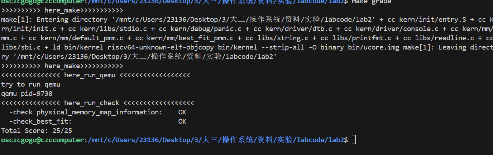

# LAB2 报告（六部分版）：练习与原理对照

李欣益  程子晨   王邵与


## 一、练习1：理解 First‑Fit 连续物理内存分配算法（思考题）


1) 关键数据结构与宏（见 `memlayout.h` 与 `pmm.h`）
- `struct Page { ref, flags, property, page_link }`
- 标志位：`PG_reserved`（保留，不可分配），`PG_property`（仅空闲块头页置位，`property`=块长）
- 自由链表：`free_area_t { list_entry free_list; size_t nr_free; }`（按页号递增有序）
- 地址换算：`PADDR`（VA→PA）、`pa2page`、`page2pa`

2) 初始化流程（`pmm.c::page_init()` → `default_init()` → `default_init_memmap()`）
- `page_init()`：
  - 解析 DTB 获得 `memory_base/size`，计算 `npage`；
  - 将 `pages[]` 置于内核镜像末尾并页对齐；
  - 先将 `[0, npage-nbase)` 全部 `SetPageReserved`；
  - 计算 `freemem = PADDR(pages + sizeof(Page)*(npage-nbase))`，上取整到页边界为 `mem_begin`；
  - 调用 `init_memmap(pa2page(mem_begin), (mem_end-mem_begin)/PGSIZE)` 释放实际可用区间。
- `default_init()`：清空自由链与计数。
- `default_init_memmap(base, n)`：
  - 要求区间此前为保留态；逐页清零 `flags/ref/property`；
  - 设置 `base->property=n; SetPageProperty(base);` 作为空闲块头；
  - 按页号递增插入到 `free_list`；`nr_free += n`。

3) 分配流程（`default_alloc_pages(n)`）
- 自由链从头扫描，命中第一个 `property >= n` 的块：
  - 若 `== n`：整块摘除；
  - 若 `> n`：在 `page+n` 处分裂，余块头 `property = old - n; SetPageProperty` 并保持有序；
- 维护 `nr_free -= n`，对返回块清除 `PG_property`（防止被当空闲头二次处理）。

4) 释放流程（`default_free_pages(base, n)`）
- 将 `[base, base+n)` 标记为空闲；`base->property = n; SetPageProperty(base); nr_free += n`；
- 按页号有序插入后，与前/后相邻块（物理连续）尝试合并：
  - 合并时仅保留合并后头页的 `property` 与 `PG_property`，其余页清零。

5) 自检（`default_check()`）
- 覆盖连续/非连续分配、分裂与合并、边界条件及 `nr_free`/属性一致性。


6) 进一步的改进空间
- 时间效率：
  - 维护“按大小”或“分级”的多链表，减少扫描；
  - 记录“上次命中指针”以提高局部性。
- 碎片控制：
  - 改为 Best‑Fit/Worst‑Fit 作为启发式；
  - 延迟合并或批处理回收。


7) 代码解读

【default_init】初始化自由链表与计数

```c
static void
default_init(void) {
  list_init(&free_list);
  nr_free = 0;
}
```
- 作用：清空空闲链，置空闲页数为 0。
- 触发点：`pmm.c::init_pmm_manager()` 调用 `pmm_manager->init()`。

【default_init_memmap】将一段页区间标记为空闲并插入有序链

```c
static void
default_init_memmap(struct Page *base, size_t n) {
  assert(n > 0);
  struct Page *p = base;
  for (; p != base + n; p ++) {
    assert(PageReserved(p));
    p->flags = p->property = 0;
    set_page_ref(p, 0);
  }
  base->property = n;
  SetPageProperty(base);
  nr_free += n;
  if (list_empty(&free_list)) {
    list_add(&free_list, &(base->page_link));
  } else {
    list_entry_t* le = &free_list;
    while ((le = list_next(le)) != &free_list) {
      struct Page* page = le2page(le, page_link);
      if (base < page) {
        list_add_before(le, &(base->page_link));
        break;
      } else if (list_next(le) == &free_list) {
        list_add(le, &(base->page_link));
      }
    }
  }
}
```

  - 预期输入区间此前均为 `PG_reserved`；这里清零标志/引用计数；
  - 仅在基页处设置 `PG_property` 与 `property=n`；
  - 按“页号递增”插入，确保相邻块后续可 O(1) 判断合并；
  - `nr_free` 增加 `n`。

【default_alloc_pages】First‑Fit 扫描与分裂

```c
static struct Page *
default_alloc_pages(size_t n) {
  assert(n > 0);
  if (n > nr_free) {
    return NULL;
  }
  struct Page *page = NULL;
  list_entry_t *le = &free_list;
  while ((le = list_next(le)) != &free_list) {
    struct Page *p = le2page(le, page_link);
    if (p->property >= n) {
      page = p;
      break;
    }
  }
  if (page != NULL) {
    list_entry_t* prev = list_prev(&(page->page_link));
    list_del(&(page->page_link));
    if (page->property > n) {
      struct Page *p = page + n;
      p->property = page->property - n;
      SetPageProperty(p);
      list_add(prev, &(p->page_link));
    }
    nr_free -= n;
    ClearPageProperty(page);
  }
  return page;
}
```

  - 扫描第一个 `property>=n` 的块命中即停；
  - 摘链后若大于 n，则在 `page+n` 分裂出余块头，重设属性并插回原位置之后（保持有序）；
  - 维护 `nr_free`，并清除返回块的 `PG_property`（不再是空闲块头）。

【default_free_pages】按序插入并与相邻合并

```c
static void
default_free_pages(struct Page *base, size_t n) {
  assert(n > 0);
  struct Page *p = base;
  for (; p != base + n; p ++) {
    assert(!PageReserved(p) && !PageProperty(p));
    p->flags = 0;
    set_page_ref(p, 0);
  }
  base->property = n;
  SetPageProperty(base);
  nr_free += n;

  if (list_empty(&free_list)) {
    list_add(&free_list, &(base->page_link));
  } else {
    list_entry_t* le = &free_list;
    while ((le = list_next(le)) != &free_list) {
      struct Page* page = le2page(le, page_link);
      if (base < page) {
        list_add_before(le, &(base->page_link));
        break;
      } else if (list_next(le) == &free_list) {
        list_add(le, &(base->page_link));
      }
    }
  }

  list_entry_t* le = list_prev(&(base->page_link));
  if (le != &free_list) {
    p = le2page(le, page_link);
    if (p + p->property == base) {
      p->property += base->property;
      ClearPageProperty(base);
      list_del(&(base->page_link));
      base = p;
    }
  }

  le = list_next(&(base->page_link));
  if (le != &free_list) {
    p = le2page(le, page_link);
    if (base + base->property == p) {
      base->property += p->property;
      ClearPageProperty(p);
      list_del(&(p->page_link));
    }
  }
}
```

  - 还原页为“空闲态”，基页设为新头；
  - 按页号插入后，先向左（前驱）再向右（后继）检查物理连续性并进行合并；
  - 合并过程中确保只有最终头页带 `PG_property` 与聚合后的 `property`，被合并的头被清标志并摘链。

8) 程序进行物理内存分配的整体过程
- 启动：`entry.S` 建立最小页表 → `init.c` → `pmm_init()`；
- 发现与建模：`dtb.c` 解析内存范围 → `pmm.c::page_init()` 放置 `pages[]`、全保留、释放可用区；
- 初始化策略：`default_init()` 清空自由链与计数；
- 释放可用区：`default_init_memmap()` 把可用段作为一个或多个空闲块插入链表；
- 分配：`default_alloc_pages(n)` First‑Fit 扫描并可选分裂，返回页块；
- 释放：`default_free_pages(base,n)` 插回有序链并与相邻合并；
- 自检：`default_check()` 覆盖常见边界与一致性。


9) First‑Fit 的进一步改进空间：
- 改进一：引入“按大小分级链表”或“有序按大小结构”（如平衡树），降低分配扫描成本；
- 改进二：结合 Next‑Fit/Best‑Fit/Worst‑Fit 的启发式，按场景优化碎片或时间；
- 改进三：收集统计（命中率/分裂率/合并率），基于阈值做自适应策略切换。

---

## 二、练习2：实现 Best‑Fit 连续物理内存分配算法（需编程）

## 1.设计与数据结构

- 空闲区状态：
  - 使用 `free_area_t` 维护空闲内存块的链表与空闲页总数：
    - `free_list`：循环双向链表，链的是“空闲块头页”的 `page_link`，按物理地址升序。
    - `nr_free`：当前空闲页总数。
- 页描述符 `struct Page`（框架提供）：
  - 空闲块仅在“头页”上标记 `PageProperty = 1`，且 `property = 连续块大小（页数）`。
  - 非头页 `property = 0`，且 `PageProperty = 0`。
- 不变量（Invariant）：
  - `free_list` 仅包含空闲块头页，且按物理地址升序。
  - `nr_free == sum(block.property for block in free_list)`。
  - 只有空闲块头页的 `PageProperty` 置位。

说明：保持链表按地址排序的直接好处是释放时可以 O(1) 判断相邻合并（只需检查前驱/后继是否相邻）。

---

## 2. 核心函数与实现说明

实现均在 `best_fit_pmm.c` 中，此外已在关键路径添加了中文注释，便于阅读与报告撰写。

### 2.1 初始化管理器
- 函数：`best_fit_init`
- 作用：初始化 `free_list` 为一个空表，`nr_free = 0`。

### 2.2 建表与空闲块初始化
- 函数：`best_fit_init_memmap(struct Page *base, size_t n)`
- 输入：区间 `[base, base + n)` 的页将成为一个新的空闲块。
- 处理：
  - 对每一页 `p`：`flags = 0`、`property = 0`、`ref = 0`。
  - 对 `base`：`property = n` 且 `SetPageProperty(base)`，标记为空闲块头。
  - `nr_free += n`。
  - 将 `base` 按“物理地址升序”插入 `free_list`（空表直接插入、否则找到第一个地址大于 `base` 的节点前插；若遍历到末尾则插尾）。
- 结果：形成一个有序空闲块链表，便于后续合并和查找。

### 2.3 分配页面（Best-Fit）
- 函数：`best_fit_alloc_pages(size_t n)`
- 策略：在 `free_list` 中寻找“最小且 ≥ n”的空闲块（Best-Fit）。
- 步骤：
  - 若 `n > nr_free` 直接返回 `NULL`。
  - 遍历 `free_list`，维护 `min_size`，记录当前“最优候选块” `page`。
  - 找到后：
    - 将该块从链表删除。
    - 若块大小大于 `n`，从 `page + n` 处建立“余块”：
      - `p = page + n; p->property = old - n; SetPageProperty(p);`
      - 将余块插回原位置的前驱之后，保持链表按地址有序。
    - `nr_free -= n`，并对返回块 `ClearPageProperty(page)`（被分配出去不再是空闲块头）。
  - 返回 `page`（分配到的页块起始地址）。
- 正确性要点：
  - 仅头页在链表且记录长度，拆分后新的“余块头页”进入链表。
  - 不破坏链表按地址有序性。

为什么是 Best-Fit：遍历全表找最小满足的块，避免像 First-Fit 那样“误用较大的前面块”，从而尽量减少碎片。

### 2.4 释放页面与合并
- 函数：`best_fit_free_pages(struct Page *base, size_t n)`
- 步骤：
  - 对 `[base, base + n)` 每页断言 `!Reserved && !Property`，并清 `flags`、`ref = 0`。
  - 设置 `base->property = n`，`SetPageProperty(base)`，`nr_free += n`。
  - 将 `base` 按“地址升序”插入 `free_list`。
  - 尝试向左合并（前驱块）：若前驱 `p` 满足 `p + p->property == base`，则把 `base` 并入 `p`：
    - `p->property += base->property; ClearPageProperty(base); list_del(&base->page_link); base = p;`
  - 再尝试向右合并（后继块）：若 `base + base->property == next`，则把 `next` 并入 `base`，删除 `next`。
- 结果：尽量维持空闲块连续性，降低碎片。

---

## 3. 时间与空间复杂度
- 查找空闲块：需要遍历空闲链表，时间复杂度 `O(n)`。
  - First-Fit：平均早停；Best-Fit：必须遍历完整表寻找最小满足者，通常更慢。
- 切割与合并：`O(1)`。
- 额外空间：仅链表节点在 `Page` 内部，常数级。

> 题目不要求复杂度优化，以通过测试为目标，该实现满足要求。

---

## 4. 测试验证要点

自检位于 `best_fit_check`，重要验证点如下：
- 构造形态：先 `alloc_pages(5)`，再部分释放形成“2 页空闲 + 1 页空闲”的碎片形态。
- 随后 `alloc_pages(1)`：
  - Best-Fit 必须挑选“最小的那个块”（即大小为 1 的块），从而保留 2 页块不被破坏。
  - 测试用 `assert(p0 + 4 == p1)` 验证返回的正是 1 页块地址。
- 接下来 `alloc_pages(2)` 需要成功：
  - 如果之前 1 页的请求错误地从 2 页块里切了一页（First-Fit 会这样做），则 2 页连续块被破坏，当前分配将失败；
  - Best-Fit 保留了 2 页块，因此这里确实能 `!= NULL`。

因此，`best_fit_check` 的这两步正是“区分 First-Fit 与 Best-Fit”的关键断言。

---

## 5. 与 First-Fit（默认实现）对比

对比对象：`default_pmm.c`（First-Fit）。

- 策略差异
  - First-Fit：从低地址开始，遇到第一个“足够大”的块就用，可能切割。
  - Best-Fit：在所有满足的块中选择“最小”的那个，尽量减少浪费和碎片。
- 行为差异（重要用例）
  - 在“2 页空闲 + 1 页空闲”的情况下：
    - 申请 1 页：
      - First-Fit 会拿前面的 2 页块，切出 1 页，导致 2 页连续块被破坏。
      - Best-Fit 会拿恰好 1 页的块，保留 2 页连续块。
    - 随后申请 2 页：First-Fit 失败，Best-Fit 成功。
- 复杂度
  - First-Fit：平均更快（可能早停）。
  - Best-Fit：需要遍历全表以保证“最优”，平均更慢。
- 碎片化
  - Best-Fit 通常减少外部碎片，但也可能产生很多很小的空闲块，增加后续分配时间。
  - First-Fit 容易破坏前面的较大块，导致较快出现碎片，在某些场景下表现更差。

结论：本实验测试用例专门针对上述差异，Best-Fit 按预期通过。

---

## 6. 可改进空间

虽然题目不要求时空复杂度优化，但可讨论潜在改进：

- 更快的“最优块”查找
  - 维护“按块大小排序”的辅助结构（平衡树、跳表、分级空闲链表 segregated free lists），将查找“最小可用块”降至 `O(log n)` 或近似 `O(1)`。
  - 同时仍需维护“按地址排序”的链表用于快速合并（两套索引）。
- 合并策略优化
  - 现在已支持左右邻居合并。可考虑使用边界标记（boundary tag）或位图/伙伴系统。
  - 伙伴系统（buddy allocator）合并和查找都可做到 `O(log N)`，但块大小必须为 2 的幂，策略不同于 Best-Fit。
- 减少碎片的启发式
  - 切割时可选择从块尾切割、或针对特定场景调参。
  - 延迟合并（deferred coalescing）或周期性全表合并，平衡实时性与碎片度。
- 退化保护
  - 对“超小块过多”的情况设立聚合阈值，超过阈值触发整理。
- 绑定策略
  - 等大小块的 tie-breaking 规则（例如靠后地址优先）以更好地保持前部大块连续性。

---

## 7. 结论

- 已在 `best_fit_pmm.c` 完成了 Best-Fit 页面分配算法的实现：
  - 初始化空闲块并按地址有序插入。
  - 分配时全表扫描选择“最小满足”的块，并在必要时切割“余块”。
  - 释放时按地址插入并进行左右相邻合并。
- 已在代码中补充了详细中文注释，说明每步操作目的与不变量维护。
- 与 First-Fit 相比，Best-Fit 通过在关键场景保留更大的连续块，顺利通过了 `best_fit_check` 的“特性断言”，实现目标。

---

## 三、扩展练习（编程）：Buddy System（伙伴系统）分配算法（含设计与测试）


### 1. 目标与算法概述

- 以 2^k 页为单位管理空闲块（block），每个阶次 order=k 对应大小为 1<<k 页的块。
- 分配：若目标阶空，则向更高阶寻找并逐级二分（split down）直到目标阶。
- 释放：按对齐切块并递归查找“伙伴”（buddy，索引异或 1<<k），若伙伴空闲且同阶则合并（coalesce up）。
- 正确性关键：每阶自由链只包含“空闲块头页”，头页的 `Page.property` 必须等于块大小（以页为单位），且带 `PG_property` 标志。

### 2. 数据结构与不变量

- 位置：`kern/mm/buddy_pmm.c`
- 核心结构：
  - `buddy.freelist[MAX_BUDDY_ORDER+1]`：每阶循环双向链表，链的是空闲块的“头页”。
  - `buddy.nblocks[order]`：该阶空闲块数，便于快速统计与自检。
  - `buddy.max_order`：运行期最大阶，受物理页数与宏 `MAX_BUDDY_ORDER` 双重约束。
- 页头知识：仅空闲块“头页”携带 `PG_property` 与 `property=块大小(页数)`；非头页 `property=0` 且 `PG_property=0`。
- 不变量（verify_invariants 逐项断言）：
  1) 对任意阶 o，`freelist[o]` 上的每个节点 `p` 都满足 `PageProperty(p)` 且 `p->property == (1<<o)`。
  2) `buddy.nblocks[o]` 恰好等于该阶链表中的块个数。
  3) `sum_o(nblocks[o] * (1<<o)) == buddy_nr_free_pages()`。

### 3. 核心函数与代码解读

下面仅截取关键片段，并解释其职责与边界条件。完整实现见 `kern/mm/buddy_pmm.c`。

【初始化管理器】设置运行期最大阶与各阶空链

```c
static void buddy_init(void) {
  flist_init(); // 清空各阶链与计数
  int max_by_npage = ilog2_floor(npage > 0 ? npage : 1);
  buddy.max_order = max_by_npage < MAX_BUDDY_ORDER ? max_by_npage : MAX_BUDDY_ORDER;
}
```

- 作用：保证 `max_order` 不超过物理页总数能承载的极限阶次；建立干净的空闲链状态。

【建立空闲表】把 `[base, base+n)` 切成“对齐的 2^k 块”并入对应阶链表

```c
static void buddy_init_memmap(struct Page *base, size_t n) {
  assert(n > 0);
  // 提升运行期最大阶，使后续分裂/合并有上界
  int max_by_n = ilog2_floor(n);
  int new_max = max_by_n < MAX_BUDDY_ORDER ? max_by_n : MAX_BUDDY_ORDER;
  if (new_max > buddy.max_order) buddy.max_order = new_max;

  // 清页面状态
  for (struct Page *p = base; p != base + n; ++p) {
    assert(PageReserved(p));
    p->flags = 0; p->property = 0; set_page_ref(p, 0);
  }

  // 以地址低位 0 的个数（对齐）与剩余长度共同决定当前块的阶次
  struct Page *cur = base; size_t remain = n;
  while (remain > 0) {
    size_t idx = page_index(cur);
    int align_ord = ctz_size_t(idx);     // 对齐约束
    int size_ord  = ilog2_floor(remain); // 剩余长度约束
    int ord = align_ord < size_ord ? align_ord : size_ord;
    if (ord > buddy.max_order) ord = buddy.max_order;
    push_block(ord, cur);                // 将块头入对应阶链
    cur += (1u << ord);
    remain -= (1u << ord);
  }
}
```

- 要点：使用“最低位 1 的位置”确定当前地址能容纳的最大对齐阶；与剩余长度取最小。
- 成果：各阶形成“完美对齐的 2^k 空闲块”的覆盖；为分裂/合并打好基础。

【分配页面】向上寻找非空阶并逐级二分到目标阶

```c
static struct Page *buddy_alloc_pages(size_t n) {
  int need_ord = ilog2_ceil(n);           // 向上取整至 2^k
  int o = need_ord;
  while (o <= buddy.max_order && list_empty(&buddy.freelist[o])) ++o;
  if (o > buddy.max_order) return NULL;   // OOM

  struct Page *blk = pop_block(o);        // 取到更大块
  while (o > need_ord) {                  // 逐级二分
    o -= 1;
    struct Page *right = blk + (1u << o);
    push_block(o, right);               // 右半回收到低一阶链
    // 左半继续作为 blk 参与下一轮分裂
  }
  ClearPageProperty(blk);                 // 返回块从自由态转占用态
  return blk;
}
```

- 复杂度：寻找非空阶 `O(MaxOrder)`，分裂次数 `O(MaxOrder)`，总为对数级。
- 正确性：始终保持“右半回收、左半继续”，保证地址连续性与对齐性。

【释放页面】按对齐切块并尝试与伙伴递归合并

```c
static void buddy_free_pages(struct Page *base, size_t n) {
  // 还原页状态
  for (struct Page *p = base; p != base + n; ++p) {
    assert(!PageReserved(p) && !PageProperty(p));
    p->flags = 0; set_page_ref(p, 0);
  }

  struct Page *cur = base; size_t remain = n;
  while (remain > 0) {
    size_t idx = page_index(cur);
    int align_ord = ctz_size_t(idx);
    int size_ord  = ilog2_floor(remain);
    int ord = align_ord < size_ord ? align_ord : size_ord;
    if (ord > buddy.max_order) ord = buddy.max_order;

    struct Page *blk = cur; int co_ord = ord;
    for (;;) { // 递归向上尝试合并
      size_t blk_idx = page_index(blk);
      size_t bud_idx = blk_idx ^ (1u << co_ord);
      struct Page *buddy_blk = blk + (bud_idx - blk_idx);
      if (PageProperty(buddy_blk) && buddy_blk->property == (1u << co_ord)) {
        if (find_block_in_order(co_ord, buddy_blk)) { // 从该阶链中删掉伙伴
          if (buddy_blk < blk) blk = buddy_blk;     // 新块头选低地址
          co_ord += 1;                              // 晋升一阶继续尝试
          if (co_ord > buddy.max_order) break;
          continue;
        }
      }
      push_block(co_ord, blk);                          // 无法再合并，入链
      break;
    }
    cur += (1u << ord);
    remain -= (1u << ord);
  }
}
```

- 合并条件：伙伴必须“同阶、空闲且为块头”，并且确实存在于对应阶链表（`find_block_in_order` 会定位并删除）。
- 边界：若已到 `max_order` 或找不到伙伴，则停止合并并将当前块挂回对应阶。

【统计/自检】

```c
static size_t buddy_nr_free_pages(void) {
  size_t total = 0;
  for (int o = 0; o <= buddy.max_order; ++o)
    total += buddy.nblocks[o] * (1u << o);
  return total;
}

static void verify_invariants(void) { /* 遍历各阶链表断言第2节全部不变量 */ }
static void dump_buddy_state(const char *tag) { /* 打印每阶块数与页数 */ }
```

- 用途：在 `buddy_check()` 自检用例前后调用 `verify_invariants()` 与 `dump_buddy_state()`，便于定位问题。

### 4. 边界与错误模式讨论（工程细节）

- max_order 的设定：必须受 `npage` 约束，否则会出现“分裂到空阶”或“越界”的风险；本实现分别在 `buddy_init` 与 `buddy_init_memmap` 中约束。
- 释放的实际长度：例如 `alloc(3)` 实际得到 4 页，应按 4 页释放，否则总量校验会不平衡；自检已覆盖并在日志中展示修正（见下）。
- 页状态复位：释放前逐页清 `flags/ref`，防止后续被误判为保留或空闲头之外状态。
- 伙伴定位必须基于“页号索引的异或”，而非仅比较物理地址差；否则遇到非对齐的切块会误判。

### 5. 测试用例与覆盖（buddy_check）

位置：`buddy_check()`，覆盖如下场景，并在每步后调用 `verify_invariants()`：

1) 基本用例 basic_check：
   - 连续分配 1、2、3(→4) 页，并核对 `nr_free` 的守恒；随后按 1/2/4 页顺序释放，确保总空闲恢复并打印每阶链表分布。
2) 跨阶分裂/回收：
   - 对每个阶 o：分配一个 2^o 块，检查对齐 `(page_index & (2^o-1)) == 0`，释放后 `nr_free` 恢复。
3) 双块合并：
   - 同阶分配两块，分别释放，验证统计值递增并维持不变量（是否恰为伙伴由运行时决定）。
4) 阶别耗尽与恢复：
   - 在一个阶上尽量多分配（最多 128 个），再全部释放，验证总量恢复。
5) 随机压力与重叠校验：
   - 随机在小阶分配/释放，记录 `(idx,len)` 区间，任何新分配都断言与已分配区间“绝不重叠”，最终全部释放并确保不变量成立。


部分运行日志内容：
```
  order 10: blocks=1 pages=1024
  order 11: blocks=1 pages=2048
  order 12: blocks=1 pages=4096
  order 13: blocks=1 pages=8192
  order 14: blocks=1 pages=16384
[buddy] allocated a(1 page)
[buddy] allocated b(2 pages)
[buddy] allocated c(3->4 pages)
[buddy] end basic_check: max_order=14 total_free=31929 pages
  order  0: blocks=1 pages=1
  order  3: blocks=1 pages=8
  order  4: blocks=1 pages=16
  order  5: blocks=1 pages=32
  order  7: blocks=1 pages=128
  order 10: blocks=1 pages=1024
  order 11: blocks=1 pages=2048
  order 12: blocks=1 pages=4096
  order 13: blocks=1 pages=8192
  order 14: blocks=1 pages=16384
check_alloc_page() succeeded!
satp virtual address: 0xffffffffc0205000
satp physical address: 0x0000000080205000
```


### 6. 切换与运行

- 已在 `kern/mm/pmm.c::init_pmm_manager()` 选择 `pmm_manager = &buddy_pmm_manager;`，启动后会运行 `buddy_check()` 并打印如上日志。
- 若需改回 First‑Fit/Best‑Fit，可在同处切换到 `&default_pmm_manager` 或 `&best_fit_pmm_manager`。

在 Windows PowerShell（或 WSL）下的典型构建运行：

```powershell
make clean; make qemu
```

观察串口/终端输出中的 `[buddy]` 段与 `check_alloc_page() succeeded!` 以确认通过自检。

### 7. 复杂度、优势与可改进点

- 分配/释放路径的阶次相关复杂度均为 O(MaxOrder) ≈ O(log N)，优于单链表扫描的 First/Best-Fit。
- 限制在于块大小必须为 2^k，可能在请求非 2^k 页时产生“向上取整”的内部碎片；适合与上层（如 SLUB）搭配，减少浪费。
- 可改进：
  - 引入位图压缩表示，减少链表遍历常数；
  - 加入更强的对齐/边界断言与统计（分裂次数、合并成功率）；
  - 多核环境下需引入每阶自旋锁或局部化 per-CPU 伙伴池，降低锁竞争。

---

## 四、扩展练习（编程）：SLUB 任意大小内存单元分配（设计与测试）


### 1. 数据结构与不变量

- `struct kmem_cache`：每种对象尺寸对应一个 cache，记录对象大小/对齐、每 slab 的对象数、每 slab 占用页数，以及三条链表：
  - `partial`：尚有空闲对象的 slab；
  - `full`：无空闲对象；
  - `empty`：全部空闲（此实现选择延迟回收页，在 destroy 时统一释放）。
- `struct slab`：位于 slab 起始的头部，含：
  - `head_page`：该 slab 起始页；
  - `free_list`：单链表，元素为对象头 `obj_hdr_t`；
  - `inuse/total`：已用对象数 / 总对象数；
  - `link`：挂到 cache 的 partial/full/empty 对应链。
- `struct obj_hdr`：对象头，位于对象数据前：
  - `next`：空闲链指针；
  - `slab`：反向指向所属 slab，便于 free 时 O(1) 找到 slab 与 cache。

不变量（`verify_cache()` 校验）：
1) 对每个 slab，`0 <= inuse <= total`；空闲链长度 + inuse == total。
2) full 链 slab 满足 `inuse==total` 且 `free_list==NULL`；empty 链 slab 满足 `inuse==0` 且 `free_list` 容纳全部对象；partial 链介于其间。

### 2. 核心流程与函数解读

【创建 cache】`kmem_cache_create(name, size, align)`
- 选择 slab 页数：
  - 若 1 页可容纳 ≥1 个对象，则 `slab_pages=1`；
  - 否则选用“页数向上取最近 2 的幂”，以容纳至少 1 个对象（便于对齐和批量 carve）。
- 用一页作为 cache 描述符（`meta_page`）。

【新建 slab】`slab_new(cache)`
- 通过 `alloc_pages(cache->slab_pages)` 获取连续页；
- 将 `slab_t` 头部放在 slab 开头，随后用 `slab_build_freelist()` 按 stride（对象头 + 对齐后数据）构建 `free_list`；
- 新 slab 初始化为 partial 并入链。

【分配对象】`kmem_cache_alloc(cache)`
- 快路径：从 `partial` 首 slab 的 `free_list` 弹出一个对象；`inuse++`；若变满则迁移到 `full` 链；
- 若 `partial` 为空，`slab_new()` 分配新的 slab。

【释放对象】`kmem_cache_free(cache, obj)`
- 取回对象头 `obj_hdr` 与其 `slab`，头插回 `free_list`；
- 若释放前 slab 在 `full`，需迁移到 `partial`；`inuse--`；若 `inuse==0`，迁移到 `empty`（此实现不即时归还页，以保持简单）。

【销毁 cache】`kmem_cache_destroy(cache)`
- 遍历 `partial/full/empty` 三链释放 slab 页；最后释放 `meta_page`。

### 3. 边界处理与设计取舍

- 对齐与步长：对象实际步长为 `round_up(sizeof(obj_hdr), align) + round_up(size, align)`；slab 头部空间通过 `header = round_up(sizeof(slab_t), align)` 保证后续对象对齐。
- 多页 slab：当对象很大时采用 2^k 页的 slab，减少外部碎片并保持地址/对齐友好。
- 回收策略：简化实现中，empty slab 暂不立即 `free_pages`，而是集中在 `kmem_cache_destroy` 时释放；这使 fast-path 逻辑更清晰。
- 一致性校验：`verify_cache()` 在自测各阶段检查三条链和 `inuse/free_list` 的一致性。

### 4. 自测用例与覆盖（`slub_selftest()`）

1) 小对象 cache：32B 对象，容量跨越 ≥2 个 slab；分配填满、交替释放、再释放完，期间多次 `verify_cache()`；并对分配内存写入填充字节，验证可写。
2) 中对象 cache：128B 对象，分配-释放多次，校验 invariants。
3) 大对象 cache：6000B 对象（多页 slab），分配 3 组并部分立即释放，校验 invariants，覆盖多页对齐与步长计算。
4) 清理：`kmem_cache_destroy` 回收所有 slab 与 meta_page。

启用方式（可选）：在 `pmm.c` 末尾已有宏保护代码——

```c
#ifdef SLUB_RUN_SELFTEST
    slub_init();
    slub_selftest();
    cprintf("[slub] selftest passed\n");
#endif
```

如需运行自测而不影响 PMM 评分：

```powershell
make clean; make "DEFS+=-DSLUB_RUN_SELFTEST"; make qemu
```

### 5. 与 Linux SLUB 的差异（简化点）

- 未实现缓存合并（kmalloc-size 通道）与 NUMA/CPU 本地化的 per-CPU 部分链；
- 未实现对象着色、红黑树/位图等更复杂的管理结构；
- 回收策略保守（empty 延迟释放），可按需求扩展一个“空 slab 立即释放”的策略分支。

---

---

## 五、扩展练习（思考）：如果 OS 无法预先得知可用物理内存范围，应如何获取？

现实系统中，可靠做法是“让更早期的固件/引导阶段把内存地图传给 OS”，OS 只需解析并做边界校验。若假设无法提前获知，也应从下列渠道“在早期尽可能准确地获得”：

1) 固件/引导提供（首选，跨平台通用接口）
- RISC‑V/Arm：设备树（DTB/FDT）中的 `memory` 节点与 `reg` 属性提供物理内存段；内核早期解析 FDT（如本实验 `kern/driver/dtb.c`）。
- x86 BIOS：INT 0x15, E820/E801 提供类型化内存段；现代仍支持 e820 表导入。
- UEFI：`GetMemoryMap()` 返回 EFI 内存描述符数组，包含类型（可用/保留/ACPI/NVS 等）、物理起止；Bootloader 将其传递给内核或置于约定处。
- ACPI：以 SRAT/SLIT/ HMAT 为 NUMA/拓扑补充，但并非基础可用内存发现的唯一来源。

2) Bootloader/运行时参数传递
- 将内存地图通过启动参数、保留页、或特定协议（如 Multiboot/Multiboot2）传递给内核；
- 内核只需校验“和自身占用区域不冲突”，并对未知类型区域一律保守处理为保留。

3) 平台服务调用（次选，依赖平台）
- 某些固件（如 OpenSBI、SMM/SMC 服务）可在运行时提供内存段查询接口；
- 优点：可在更晚期动态获知；缺点：平台绑定强，错误处理复杂。

4) 设备枚举/控制器寄存器（特例）
- 特殊 SoC 可能通过 MMIO 寄存器暴露 DRAM 尺寸/Bank 布局；
- 只能作为平台特定补充路径，且仍需与固件地图交叉验证。

5) 不推荐/高风险方式
- “写-读探测”物理地址空间试探大小在现代系统不可取：
  - 可能破坏设备寄存器或保留区域；
  - Cache、一致性、IOMMU、总线及安全隔离会使探测结果不可靠；
  - 在虚拟化/安全固件环境中常被禁止。

6) 统一抽象与落地建议
- 统一抽象：OS 以“内存段数组 {base, length, type}”作为输入，过滤掉非可用类型（如保留/设备/ACPI/NVS），并对齐到页边界。
- 边界校验：
  - 移除与内核镜像、页表、`pages[]` 元数据重叠的区域；
  - 限制到体系结构允许的最高物理地址（如本实验的 `KERNTOP`）。
- 兼容路径：
  - 优先 FDT/UEFI/Multiboot；若缺失则尝试平台服务；
  - 最终至少保留“单段保守范围”（例如从内核末到某个保守上限的最小可用段），以保证系统可启动；
  - 启动后可在驱动加载阶段再次校验/收敛地图（例如通过 ACPI/SMBIOS 等补充信息）。

综上，正确的思路不是“OS 自己探测”，而是“标准化早期组件负责发现，OS 进行解析与校验”。这也与课程实验中通过 DTB 获取 `memory_base/size` 并在 `pmm.c::page_init()` 中构建 `pages[]`、释放可用区的流程一致。

---

## 六、实验知识点 ↔ OS 原理知识点（含关系/差异）


1) DTB 解析（`dtb.c`） ↔ 硬件抽象/设备枚举（FDT/ACPI）
- 实验取内存起点/大小；原理层面还涵盖设备树兼容串、地址单元、对齐、版本等。

2) 启动映射（`entry.S`） ↔ Sv39 多级页表/模式切换
- 实验用 1GiB 大页确保可运行；原理强调权限/TLB/异常等完整约束。

3) 页框元数据（`pages[]`） ↔ 物理内存抽象与映射
- 实验以线性数组管理连续 DRAM；原理需兼顾洞洞、NUMA、热插拔。

4) 空闲链与策略（`default_pmm.c`/`best_fit_pmm.c`） ↔ 各类分配算法
- 实验关注可验证性；原理关注复杂度/局部性/碎片的工程权衡。

5) 分裂/合并约束 ↔ 边界标记/O(1) 合并技巧
- 实验只在头页持有 `property`；原理常在块尾也存储元信息以加速合并。

6) 引用计数/保留标志 ↔ 页面生命周期/共享/写时复制
- 实验用于基础正确性；原理用于进程间共享与换页策略。

7) 地址换算宏 ↔ 内核地址空间布局/安全
- 实验以断言与恒等式校验；原理应对 kASLR/PAE/多映射段等复杂情形。

---

## 附：OS 原理重要但本实验未覆盖或弱化的知识点

- 伙伴系统与分级空闲链（工程常用，未在本实验实现）
- SLAB/SLUB 对象层分配（内核对象高效管理）
- 虚拟内存进阶：缺页/置换/COW/按需分页
- 多核并发：锁/关中断/RCU/原子性
- NUMA/亲和性与拓扑感知
- 安全：页级权限、隔离、随机化
- 透明大页（THP）管理策略
- 内存热插拔与 ECC 错误处理
- IOMMU/DMA 友好分配与特殊内存区域
- 形式化规格与验证/回归测试体系

