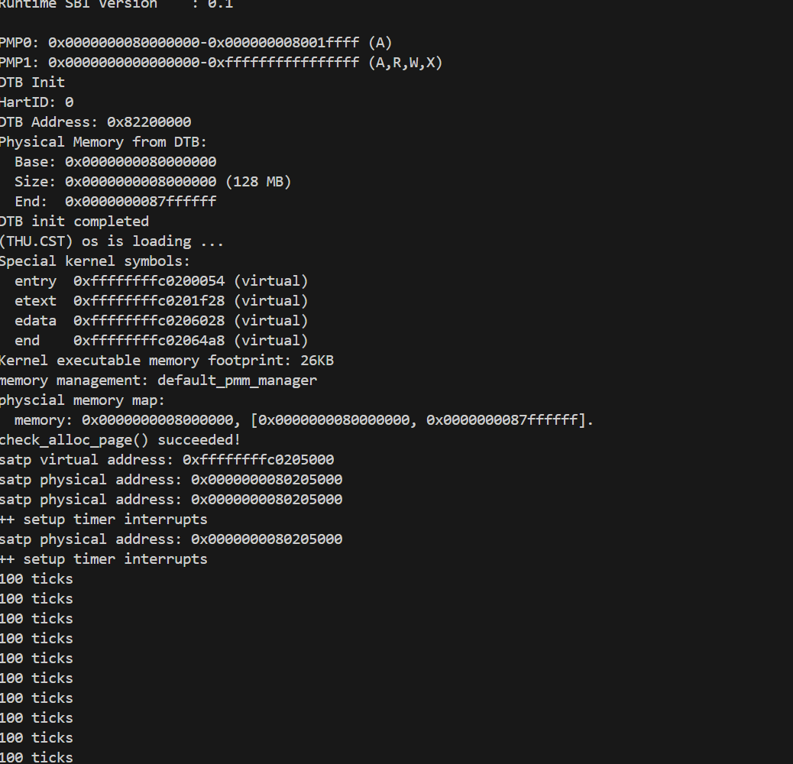
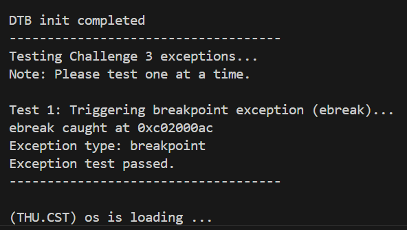
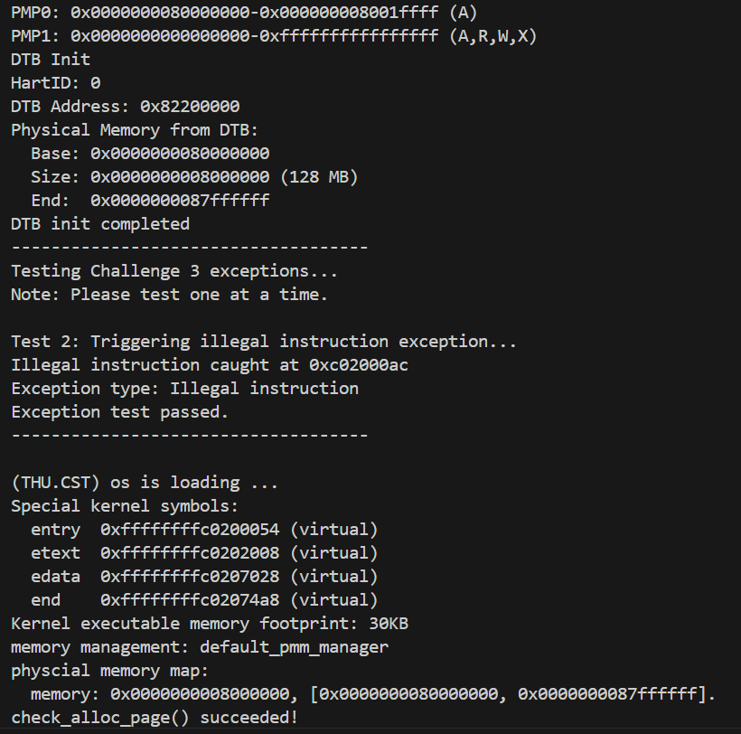

# LAB3 报告：中断、异常与系统调用
李欣益
## 一、练习1：完善中断处理（需编程）

### 1. 设计与数据结构

本次练习的核心是在时钟中断服务例程中实现周期性打印和定时关机功能。设计上不涉及复杂数据结构的修改，而是通过在中断处理函数内部巧妙地使用静态变量来维持状态。

- **`static size_t ticks`**:
  - **作用**：作为时钟中断的内部计数器，记录自上次打印以来发生的中断次数。
  - **生命周期**：声明为 `static`，使其生命周期贯穿整个内核运行期间，值在多次中断调用之间得以保持。它在 `interrupt_handler` 首次被调用时初始化为0。

- **`static int print_count`**:
  - **作用**：记录 "100 ticks" 信息被打印的次数，用于判断何时触发关机。
  - **生命周期**：同样声明为 `static`，以在中断调用间持久化。

- **`#define TICK_NUM 100`**:
  - **作用**：一个宏定义，明确了触发打印操作的周期，便于后续调整。

- **必要的头文件**:
  - 为了调用关机功能，必须包含 `<sbi.h>` 以引入 `sbi_shutdown()` 函数的声明。

### 2. 核心函数与实现说明

所有实现均集中在 `kern/trap/trap.c` 的 `interrupt_handler` 函数中，特别是针对 `case IRQ_S_TIMER:` 的处理分支。

【interrupt_handler】处理时钟中断

```c
// kern/trap/trap.c

void interrupt_handler(struct trapframe *tf) {
    intptr_t cause = (tf->cause << 1) >> 1;
    switch (cause) {
        // ... 其他 case ...
        case IRQ_S_TIMER: {
            /* LAB3 EXERCISE1   YOUR CODE :  */
            // 定义静态变量以在函数调用间保持状态
            static size_t ticks = 0;
            static int print_count = 0;

            // (1) 每次时钟中断，计数器加一
            ticks++;

            // (2) 判断计数器是否达到 100
            if (ticks == TICK_NUM) {
                // 达到100次后，重置计数器
                ticks = 0;
                // 调用函数，打印 "100 ticks"
                print_ticks();
                // 打印次数加一
                print_count++;

                // (3) 判断打印次数是否达到10次
                if (print_count == 10) {
                    // 调用sbi.h中的关机函数
                    sbi_shutdown();
                }
            }
            // (4) 设置下一次时钟中断，这是必须的
            clock_set_next_event();
            break;
        }
        // ... 其他 case ...
    }
}
```


可见 测试正确输出10个100ticks 说明实验正确！

- **代码逻辑解读**:
  1.  **作用域与变量声明**：在 `case IRQ_S_TIMER:` 后使用花括号 `{}` 创建了一个独立的作用域块。这解决了C语言不允许在 `case` 标签后直接声明变量的语法限制。
  2.  **计数**：每次时钟中断发生，`ticks` 递增。
  3.  **周期性任务**：当 `ticks` 累积到 `TICK_NUM` (100) 时，触发核心任务：重置 `ticks`，调用 `print_ticks()`，并增加 `print_count`。
  4.  **最终任务**：在 `print_count` 达到10时，调用 `sbi_shutdown()` 关机。
  5.  **循环预约**：在所有逻辑的最后，`clock_set_next_event()` 的调用至关重要。它通过SBI向硬件预约下一次时钟中断，构成了周期性中断的闭环。若无此调用，时钟中断将仅触发一次。

### 3. 定时器中断处理全流程

结合整个项目，一次完整的定时器中断处理流程如下：

1.  **硬件触发**：CPU内部时钟到达由 `clock_set_next_event()` 预设的时间点，硬件产生一个中断信号。
2.  **CPU响应与跳转**：CPU暂停当前正在执行的任何程序，将当前程序地址（PC）存入 `sepc` 寄存器，将中断原因（`IRQ_S_TIMER`）存入 `scause` 寄存器，然后查询 `stvec` 寄存器，并跳转到其中保存的地址。
3.  **汇编入口 (`trapentry.S`)**：CPU跳转到 `__alltraps`，执行 `SAVE_ALL` 宏，将所有寄存器（CPU的“工作现场”）保存到内核栈上的一个 `trapframe` 结构体中。
4.  **调用C函数**：汇编代码调用C函数 `trap(struct trapframe *tf)`，并将刚刚保存的 `trapframe` 的地址作为参数传入。
5.  **分发任务 (`trap.c`)**：`trap()` 函数调用 `trap_dispatch()`，该函数检查 `tf->cause` 发现是中断（负数），于是调用 `interrupt_handler(tf)`。
6.  **执行中断服务 (`trap.c`)**：`interrupt_handler()` 根据 `tf->cause` 的具体值进入 `case IRQ_S_TIMER:` 分支，执行我们编写的计数、打印和关机逻辑。
7.  **预约下次中断 (`trap.c`)**：在处理逻辑的末尾，调用 `clock_set_next_event()` 来设置下一次时钟中断，形成一个闭环。
8.  **返回汇编**: C函数执行完毕，返回到 `trapentry.S`。
9.  **恢复现场 (`trapentry.S`)**：执行 `RESTORE_ALL` 宏，从 `trapframe` 中将所有寄存器的值恢复到CPU中。
10. **返回原程序**: 最后执行 `sret` 指令，CPU从 `sepc` 记录的位置继续执行，仿佛从未被打断。

### 4. 结论

- 已在 `kern/trap/trap.c` 中成功实现了周期性的时钟中断处理逻辑。
- 通过使用 `static` 变量，在多次中断调用之间维持了正确的计数状态。
- 深刻理解了 `clock_set_next_event()` 在维持周期性中断中的关键作用。
- 整个实现符合实验要求，运行后能够按预期每秒打印一次信息，并在10次后自动关机。

---

## 二、Challenge 1：描述与理解中断流程（思考题）

### 1. uCore 中断异常处理流程描述

在 uCore 操作系统中，处理一个中断或异常的流程是一个精心设计的、跨越硬件、汇编和C语言的协作过程。其详细步骤如下：

1.  **硬件触发与响应**：
    *   **事件发生**：CPU 在执行用户或内核代码时，遇到一个外部中断（如时钟、I/O设备）或内部异常（如非法指令、缺页）。
    *   **CPU 自动操作**：
        1.  暂停当前指令流。
        2.  将当前的程序计数器（PC）保存到 `sepc` (Supervisor Exception Program Counter) 寄存器，以便后续返回。
        3.  将中断或异常的原因编码存入 `scause` (Supervisor Cause) 寄存器。
        4.  根据异常类型，可能会将相关地址（如访存地址）存入 `stval` (Supervisor Trap Value) 寄存器。
        5.  CPU 自动切换到S模式（Supervisor Mode），并通常会屏蔽中断。
        6.  从 `stvec` (Supervisor Trap Vector) 寄存器中读取预设的中断向量地址，并将PC设置为该地址，实现无条件跳转。

2.  **汇编入口与保存现场 (`kern/trap/trapentry.S`)**：
    *   CPU 跳转到 `stvec` 指向的 `__alltraps` 标签处。
    *   执行 `SAVE_ALL` 宏，其核心任务是**保存上下文（context）**：
        1.  在内核栈上为 `struct trapframe` 开辟空间。
        2.  将所有通用寄存器（`x0` - `x31`）的值按照 `trapframe` 结构体的布局，依次存入栈中。
        3.  将 `sepc`, `scause`, `sstatus` 等关键CSR寄存器的值也存入 `trapframe`。
    *   至此，被中断程序的所有状态被完整地“冻结”在内存中。

3.  **调用 C 语言处理例程**：
    *   执行 `move a0, sp` 指令，将指向 `trapframe` 的栈指针 `sp` 存入 `a0` 寄存器，作为第一个参数。
    *   执行 `jal trap` 指令，跳转到 `kern/trap/trap.c` 中定义的C函数 `trap()`。

4.  **C 语言分发与处理 (`kern/trap/trap.c`)**：
    *   `trap(struct trapframe *tf)` 函数接收到 `trapframe` 指针。
    *   `trap()` 调用 `trap_dispatch(tf)`，该函数通过检查 `tf->cause` 的最高位来区分中断和异常。
    *   根据判断结果，分别调用 `interrupt_handler(tf)` 或 `exception_handler(tf)`。
    *   在具体的处理函数中，通过 `switch-case` 语句匹配 `tf->cause` 的具体值，执行相应的中断服务例程（ISR）或异常处理代码。

5.  **返回与恢复现场 (`kern/trap/trapentry.S`)**：
    *   C代码执行完毕后，返回到汇编代码的 `__trapret` 标签处。
    *   执行 `RESTORE_ALL` 宏，其操作与 `SAVE_ALL` 完全相反：从 `trapframe` 中加载值，恢复所有通用寄存器和CSR寄存器。
    *   最后执行 `sret` (Supervisor Return) 指令。硬件会自动将 `sepc` 的值恢复到PC，并恢复 `sstatus` 寄存器，使程序从被中断处无缝地继续执行。

### 2. `mov a0, sp` 的目的

`move a0, sp` 是连接汇编代码与C代码的关键桥梁，其目的非常明确：**传递参数**。

-   在 `SAVE_ALL` 宏执行完毕后，内核的栈指针 `sp` 正好指向刚刚在栈上构建完成的 `trapframe` 结构体的起始地址。
-   根据RISC-V的函数调用约定，`a0` 寄存器用于传递函数的第一个参数。
-   因此，`move a0, sp` 的作用就是**将 `trapframe` 的地址作为第一个参数，准备传递给即将被调用的C函数 `trap(struct trapframe *tf)`**。

这样，C语言层的处理函数就能通过这个指针参数，访问和修改被中断程序的所有保存下来的寄存器状态，从而进行后续的处理。

### 3. `SAVE_ALL` 中寄存器保存在栈中的位置是什么确定的？

寄存器保存在栈中的位置（即偏移量）是由 **`struct trapframe` 结构体的定义**来确定的。

-   这个结构体定义在 `kern/trap/trap.h` 文件中，它精确地描述了上下文保存时各个寄存器应有的内存布局和顺序。
-   `SAVE_ALL` 宏中的汇编代码必须严格遵守这个C语言结构体的定义。例如，如果 `struct trapframe` 中 `gpr.ra` (即 `x1` 寄存器) 是第二个成员，那么 `SAVE_ALL` 中就必须使用 `STORE x1, 1*REGBYTES(sp)` 将 `x1` 存放在相对于 `sp` 的正确偏移处。
-   这种“C语言定义结构，汇编代码填充结构”的协作方式，确保了数据在两种语言之间传递时的一致性和正确性。

### 4. 对于任何中断，`__alltraps` 中都需要保存所有寄存器吗？请说明理由。

**是的，对于任何未知来源的中断，`__alltraps` 都必须保存所有通用寄存器。**

理由如下：

1.  **中断的不可预测性**：中断随时可能发生，它会打断任意一段正在执行的代码。操作系统无法预知被中断的代码当时正在使用哪些寄存器。被中断的可能是一个计算密集的循环，它用满了所有临时寄存器（`t0`-`t6`）；也可能是一个深度嵌套的函数调用，它用了很多栈帧和保存寄存器（`s0`-`s11`）。

2.  **保证程序的透明性与正确性**：为了确保被中断的程序在恢复执行后能够得到完全正确的结果，就必须保证它的“工作环境”（即CPU寄存器状态）和中断发生前完全一致。如果只保存一部分寄存器，当中断处理函数（本身也是一个C函数，会使用寄存器）恰好修改了某个未被保存的、但对原程序很重要的寄存器时，原程序恢复后就会发生灾难性的、难以调试的错误。

3.  **统一与简化的处理模型**：为所有中断和异常提供一个统一的、全量保存的入口，极大地简化了操作系统的设计。虽然对于某些简单的中断（例如，你知道它只会打断一段从不使用浮点寄存器的代码），理论上可以不保存浮点寄存器，但这种特化处理会带来巨大的复杂性。一个“宁可多做，不可遗漏”的统一模型，在健壮性和可维护性上远胜于各种投机取巧的优化。

综上所述，保存所有寄存器是一种确保系统正确运行的、健壮的保守策略。

---

## 三、Challenge 2：理解上下文切换机制（思考题）

### 1. `csrw sscratch, sp` 与 `csrrw s0, sscratch, x0` 的操作与目的

这两条指令在 `SAVE_ALL` 宏中配合使用，是 RISC-V 上下文保存/恢复机制中的一个精巧设计，其核心目的是**在不使用额外临时寄存器的情况下，安全地保存和切换栈指针**。

**指令分解：**

1.  **`csrw sscratch, sp`**:
    *   **操作**：`csrw` (CSR Write) 指令，将通用寄存器 `sp` (Stack Pointer) 的当前值写入到 CSR 寄存器 `sscratch` (Supervisor Scratch) 中。
    *   **上下文**：在中断/异常刚发生时，`sp` 寄存器里存放的是**被中断上下文的栈指针**。如果中断来自用户态，这就是用户栈的地址；如果中断来自内核态（嵌套中断），这就是内核栈的地址。
    *   **目的**：**临时备份**被中断前的 `sp` 值。`sscratch` 就像一个保险箱，专门用来存放这个重要的地址，因为 `sp` 寄存器本身马上可能要被修改以指向内核栈。

2.  **`csrrw s0, sscratch, x0`**:
    *   **操作**：`csrrw` (CSR Read and Write) 是一条原子指令，它同时完成读和写：
        1.  **读**：读取 `sscratch` 寄存器的当前值（即刚刚存入的旧 `sp` 值），并将其存入通用寄存器 `s0`。
        2.  **写**：将通用寄存器 `x0` 的值（恒为0）写入 `sscratch` 寄存器。
    *   **目的**：
        1.  **转移备份**：将保存在 `sscratch` 中的旧 `sp` 值转移到通用寄存器 `s0` 中。`s0` 是一个被调用者保存的寄存器，可以安全地持有这个值，直到它被存入 `trapframe`。
        2.  **清空 `sscratch`**：将 `sscratch` 置为0。这是一个重要的安全措施。如果之后发生嵌套中断（即在中断处理过程中又发生一次中断），`__alltraps` 入口代码可以通过检查 `sscratch` 的值来判断中断是来自用户态（`sscratch` 非0）还是内核态（`sscratch` 为0），从而采取不同的处理策略。

**总结：**
这个指令序列的整体目的是：**安全地将当前栈指针 `sp` 的值捕获并暂存到 `s0` 寄存器中，以便后续将其保存在 `trapframe` 的栈帧里。同时，它还为处理嵌套中断留下了判断依据。** 这是在不破坏任何其他寄存器内容的前提下，完成栈信息保存的关键步骤。

### 2. `save all` 保存的 CSR 在 `restore all` 中不还原的意义

在 `SAVE_ALL` 中，`scause`（异常原因）和 `stval`（异常相关值）等CSR寄存器被保存到了 `trapframe` 中，但在 `RESTORE_ALL` 中并没有将它们从 `trapframe` 恢复到CPU的CSR寄存器中。这并非疏漏，而是其设计使然。

**意义在于：这些CSR寄存器的值是“一次性”的输入信息，而非需要恢复的状态。**

1.  **作为输入参数**：
    *   `scause` 和 `stval` 的作用是**告诉内核“发生了什么”**。当中断/异常发生时，硬件会自动设置它们的值。内核软件读取这些值，是为了诊断问题并进行相应的处理。它们就像是传递给 `trap()` 函数的**只读输入参数**。
    *   内核处理完异常后，这些值就完成了它们的使命。没有理由，也没有必要再把旧的、已处理过的异常原因写回CPU的CSR寄存器中。如果这样做，反而可能在下一次无关的异常发生时引起混淆。

2.  **与需要恢复的状态寄存器对比**：
    *   与之相对的，`sepc`（返回地址）和 `sstatus`（状态寄存器，包含中断使能位、先前特权级等）则**必须被恢复**。
    *   `sepc` 决定了 `sret` 指令执行后程序应该**回到哪里**。
    *   `sstatus` 决定了程序应该**以何种状态**（例如，是用户态还是内核态？中断是开是关？）回去。
    *   这些是构成程序执行上下文的**状态**，必须精确还原，程序才能无缝衔接。

**结论：**
`scause` 和 `stval` 是描述“**事件本身**”的瞬时信息，而 `sepc` 和 `sstatus` 是描述“**被打断的程序状态**”的持久信息。中断处理机制的核心是**处理事件**，并**恢复状态**。因此，只保存事件信息用于分析，而恢复状态信息用于返回，是完全符合逻辑的正确做法。

---

## 四、Challenge 3：完善异常中断（需编程）

### 1. 设计思路

本次挑战的目标是捕获并处理两种特定的CPU同步异常：非法指令（Illegal Instruction）和断点（Breakpoint）。设计思路如下：

1.  **定位处理函数**：所有的同步异常都在 `kern/trap/trap.c` 的 `exception_handler` 函数中进行统一分发。我们需要在该函数的 `switch` 语句中找到对应的 `case` 分支。
    *   非法指令异常对应 `CAUSE_ILLEGAL_INSTRUCTION` (定义为 0x2)。
    *   断点异常对应 `CAUSE_BREAKPOINT` (定义为 0x3)。

2.  **获取异常信息**：当异常发生时，硬件和 `SAVE_ALL` 宏已经将所有必要的信息保存在了 `trapframe` 结构体中。其中，`tf->epc` 存放着导致异常的指令的地址，`tf->cause` 存放着异常类型，这是我们需要打印和判断的关键信息。

3.  **实现处理逻辑**：
    *   **打印信息**：根据实验要求，使用 `cprintf` 函数输出异常类型和发生异常的地址 `tf->epc`。
    *   **避免无限循环**：异常处理后，如果 `epc` (Exception Program Counter) 仍然指向导致异常的指令，那么当中断返回后，CPU会再次执行这条指令，从而陷入无限的"异常-处理-返回-再异常"循环。为了避免这种情况，必须手动将 `tf->epc` 更新为下一条指令的地址。

4.  **处理指令长度问题**：
    *   RISC-V 支持压缩指令扩展（RVC），指令可以是 2 字节（压缩指令）或 4 字节（标准指令）。
    *   对于**断点异常**：`ebreak` 可能是 2 字节的 `c.ebreak` 或 4 字节的 `ebreak`，需要智能检测指令长度。
    *   对于**非法指令异常**：由于指令本身是非法的，其编码不可信，因此采用固定步进 4 字节的策略更为安全。

### 2. 核心函数与实现说明

【exception_handler】处理非法指令与断点异常

```c
// kern/trap/trap.c

void exception_handler(struct trapframe *tf) {
    switch (tf->cause) {
        // ... 其他 case ...
        
        case CAUSE_ILLEGAL_INSTRUCTION: {
             // 非法指令异常处理
             /* LAB3 CHALLENGE3   YOUR CODE :  */
            cprintf("Illegal instruction caught at 0x%08x\n", tf->epc);
            cprintf("Exception type: Illegal instruction\n");
            // For illegal instructions, we always skip 4 bytes for safety
            // because the instruction encoding is invalid and unreliable
            tf->epc += 4;
            break;
        }
        
        case CAUSE_BREAKPOINT: {
            //断点异常处理
            /* LAB3 CHALLLENGE3   YOUR CODE :  */
            cprintf("ebreak caught at 0x%08x\n", tf->epc);
            cprintf("Exception type: breakpoint\n");
            // Check if it's a compressed instruction (lower 2 bits != 11)
            // ebreak can be either 'ebreak' (4-byte) or 'c.ebreak' (2-byte)
            uint16_t inst_bp = *(uint16_t *)(tf->epc);
            tf->epc += (inst_bp & 0x3) == 0x3 ? 4 : 2;
            break;
        }
        
        // ... 其他 case ...
    }
}
```

**代码逻辑解读**：

1. **作用域与变量声明**：
   - 使用花括号 `{}` 创建独立的作用域块，解决C语言不允许在 `case` 标签后直接声明变量的语法限制。

2. **非法指令处理**：
   - 输出异常类型和地址信息。
   - **固定步进 4 字节**：因为非法指令的编码本身就是错误的，无法通过检查其低 2 位来可靠判断长度。固定跳过 4 字节是更安全的策略。
   - 即使指令实际是 2 字节的非法压缩指令，跳过 4 字节也能确保跳出非法指令区域。

3. **断点处理**：
   - 输出异常类型和地址信息。
   - **智能长度检测**：读取指令的低 16 位，检查最低 2 位：
     - 若低 2 位 = `11` (0x3)，则为标准 4 字节指令，`epc += 4`
     - 若低 2 位 ≠ `11`，则为压缩 2 字节指令，`epc += 2`
   - 这对于合法的 `ebreak` 指令是安全的，因为编译器可能生成 `c.ebreak` (压缩形式)。

4. **RISC-V 指令编码规则**：
   - RISC-V 指令集规定：指令的低 2 位用于区分指令长度
   - `inst[1:0] == 11`：标准 32 位指令
   - `inst[1:0] != 11`：16 位压缩指令（RVC）

### 3. 测试与验证

为了验证代码的正确性，我们需要在内核中手动触发这两种异常，并观察系统的行为。

#### 测试环境搭建

在 `kern/init/init.c` 的 `kern_init` 函数中添加测试代码：

```c
int kern_init(void) {
    // ... 初始化代码 ...
    
    idt_init();  // 必须先初始化中断描述符表
    
    // Challenge 3 测试框架
    cprintf("------------------------------------\n");
    cprintf("Testing Challenge 3 exceptions...\n");
    cprintf("Note: Please test one at a time.\n\n");

    // Test 1: Breakpoint exception
    cprintf("Test 1: Triggering breakpoint exception (ebreak)...\n");
    asm volatile ("ebreak");

    // Test 2: Illegal instruction exception (注释掉，避免同时测试)
    // cprintf("Test 2: Triggering illegal instruction exception...\n");
    // asm volatile (".word 0x00000000");

    cprintf("Exception test passed.\n");
    cprintf("------------------------------------\n\n");
    
    // ... 继续其他初始化 ...
}
```

#### 测试一：断点异常 (`ebreak`)

**步骤**：
1. 确保 Test 1 的代码是启用的（Test 2 注释掉）
2. 编译：`make clean && make`
3. 运行：`make qemu`

**输出**：


**验证点**：
- ✅ 成功捕获 `ebreak` 指令
- ✅ 正确输出异常地址（地址会因编译而变化）
- ✅ 正确输出异常类型
- ✅ 系统继续正常运行，打印 "Exception test passed."
- ✅ 后续时钟中断正常工作（打印 10 次 "100 ticks" 后关机）


#### 测试二：非法指令异常

**步骤**：
1. 修改 `init.c`，注释掉 Test 1，启用 Test 2：
   ```c
   // Test 1: Breakpoint exception
   // asm volatile ("ebreak");

   // Test 2: Illegal instruction exception
   cprintf("Test 2: Triggering illegal instruction exception...\n");
   asm volatile (".word 0x00000000");
   ```
2. 重新编译并运行：`make && make qemu`

**输出**：


**验证点**：
- ✅ 成功捕获非法指令 (`.word 0x00000000`)
- ✅ 正确输出异常地址
- ✅ 正确输出异常类型
- ✅ 只触发一次异常（修复后不会连续触发两次）
- ✅ 系统继续正常运行

### 4. 技术难点与解决方案

#### 难点 1：压缩指令长度判断

**问题**：最初实现时，对所有异常都使用固定的 `tf->epc += 4`，但 RISC-V 编译器可能将 `ebreak` 编译为 2 字节的 `c.ebreak`（压缩指令）。如果固定增加 4 字节，会跳到错误的地址。

**解决方案**：
- 读取指令的低 16 位：`uint16_t inst = *(uint16_t *)(tf->epc);`
- 检查低 2 位：`(inst & 0x3) == 0x3` 判断是否为 4 字节指令
- 根据判断结果选择步进：`tf->epc += (inst & 0x3) == 0x3 ? 4 : 2;`

#### 难点 2：非法指令的特殊处理

**问题**：对于 `.word 0x00000000` 这种完全非法的指令，其编码不可信。如果用压缩指令检测规则（检查低 2 位），会误判为 2 字节指令，导致只跳过 2 字节，落在非法指令的中间位置，再次触发异常。

**解决方案**：
- 对于**非法指令异常**，指令编码本身就是错误的，不应该信任其编码格式
- 采用**固定步进 4 字节**的策略，确保完全跳出非法指令区域
- 这种"宁可多跳，不可少跳"的策略在处理非法指令时更为安全

#### 难点 3：C 语言 `case` 标签后的变量声明

**问题**：在 `switch-case` 语句中，直接在 `case` 标签后声明变量会导致编译错误（C89/C90 标准限制）。

**解决方案**：
- 在 `case` 标签后立即添加花括号 `{}`，创建一个独立的代码块
- 在代码块内声明和使用变量
- 示例：
  ```c
  case CAUSE_BREAKPOINT: {
      uint16_t inst_bp = *(uint16_t *)(tf->epc);
      // ... 使用 inst_bp ...
      break;
  }
  ```

### 5. 实现亮点

1. **智能指令长度检测**：针对断点异常实现了自动识别 2 字节/4 字节指令的机制，提高了兼容性。

2. **安全优先策略**：对于非法指令异常采用固定步进策略，避免了因编码不可信导致的二次异常。

3. **完整的测试框架**：提供了清晰的测试代码和预期输出，便于验证实现的正确性。

4. **符合 RISC-V 规范**：严格遵循 RISC-V 指令编码规范，通过低 2 位判断指令长度。

### 6. 结论

- 成功在 `kern/trap/trap.c` 中实现了非法指令和断点异常的捕获与处理。
- 通过智能长度检测和安全优先策略，确保了不同情况下的正确处理。
- 通过实际测试验证了实现的正确性和健壮性。
- 深入理解了 RISC-V 指令编码规范和异常处理机制。
- 整个实现符合实验要求，能够按预期捕获异常、打印信息并安全跳过异常指令继续执行。

---

## 五、实验知识点 ↔ OS 原理知识点

本实验涉及了操作系统中至关重要的中断和异常处理机制。以下是实验中的具体知识点与通用OS原理的对应、关系及理解。

| 实验知识点 (Lab3)                                       | OS 原理知识点                               | 含义、关系与差异                                                                                                                                                                                                                                                                                                                                                                                                                                                                                                                                                                                                                                                                                                                                                                                                                                                                                                                                                                                                                                                                                                                                                                                                                                                                                                                                                                                                                                                                                                                                                                                                                                                                                                                                                                                                                                                                                                                                                                                                                                                                                                                                                                                                                                                                                                                                                                                                                                                                                                                                                                                                                                                                                                                                                                                                                                                                                                                                                                                                                                                                                                                                                                                                                                                                                                                                                                                                                                                                                                                                                                                                                                                                                                                                                                                                                                                                                                                                                                                                                                                                                                                                                                                                                                                                                                                                                                                                                                                                                                                                                                                                                                                                                                                                                                                                                                                                                                                                                                                                                                                                                                                                                                                                                                                                                                                                                                                                                                                                                                                                                                                                                                                                                                                                                                                                                                                                                                                                                                                                                                                                                                                                                                                                                                                                                                                                                                                                                                                                                                                                                                                                                                                                                                                                                                                                                                                                                                                                                                                                                                                                                                                                                                                                                                                                                                                                                                                                                                                                                                                                                                                                                                                                                                                                                                                                                                                                                                                                                                                                                                                                                                                                                                                                                                                                                                                                                                                                                                                                                                                                                                                                                                                                                                                                                                                                                                                                                                                                                                                                                                                                                                                                                                                                                                                                                                                                                                                                                                                                                                                                                                                                                                                                                                                                                                                                                                                                                                                                                                                                                                                                                                                                                                                                                                                                                                                                                                                                                                                                                                                                                                                                                                                                                                                                                                                                                                                                                                                                                                                                                                                                                                                                                                                                                                                                                                                                                                                                                                                                                                                                                                                                                                                                                                                                                                                                                                                                                                                                                                                                                                                                                                                                                                                                                                                                                                                                                                                                                                                                                                                                                                                                                                                                                                                                                                                                                                                                                                                                                                                                                                                                                                                                                                                                                                                                                                                                                                                                                                                                                                                                                                                                                                                                                                                                                                                                                                                                                                                                                                                                                                                                                                                                                                                                                                                                                                                                                                                                                                                                                                                                                                                                                                                                                                                                                                                                                                                                                                                                                                                                                                                                                                                                                                                                                                                                                                                                                                                                                                                                                                                                                                                                                                                                                                                                                                                                                                                                                                                                                                                                                                                                                                                                                                                                                                                                                                                                                                                                                                                                                                                                                                                                                                                                                                                                                                                                                                                                                                                    -
| **`stvec` 寄存器与 `__alltraps`**                      | **中断向量表 (Interrupt Vector Table)**     | **含义**: `stvec` 是RISC-V中用于指定S模式下所有中断/异常统一入口地址的CSR寄存器。中断向量表是OS中用于分发不同中断到不同处理程序的机制。 <br> **关系**: `stvec` 指向的 `__alltraps` 是uCore中断处理的“总入口”，扮演了中断向量表的角色，但它是一个“软件实现”的向量表，在进入之后才通过C代码分发。 <br> **差异**: 传统x86的IDT是硬件直接查询的表，不同中断号直接跳转到不同地址。RISC-V的 `stvec` 模式更为简化，所有中断都先跳转到同一个地址，再由软件根据 `scause` 寄存器来分发，将硬件复杂性转移给了软件。                                                                                                                                                                                                                                                                                                                                                                                                                                                                                                                                                                                                                                                                                                                                                                                                                                                                                                                                                                                                                                                                                                                                                                                                                                                                                                                                                                                                                                                                                                                                                                                                                                                                                                                                                                                                                                                                                                                                                                                                                                                                                                                                                                                                                                                                                                                                                                                                                                                                                                                                                                                                                                                                                                                                                                                                                                                                                                                                                                                                                                                                                                                                                                                                                                                                                                                                                                                                                                                                                                                                                                                                                                                                                                                                                                                                                                                                                                                                                                                                                                                                                                                                                                                                                                                                                                                                                                                                                                                                                                                                                                                                                                                                                                                                                                                                                                                                                                                                                                                                                                                                                                                                                                                                                                                                                                                                                                                                                                                                                                                                                                                                                                                                                                                                                                                                                                                                                                                                                                                                                                                                                                                                                                                                                                                                                                                                                                                                                                                                                                                                                                                                                                                                                                                                                                                                                                                                                                                                                                                                                                                                                                                                                                                                                                                                                                                                                                                                                                                                                                                                                                                                                                                                                                                                                                                                                                                                                                                                                                                                                                                                                                                                                                                                                                                                                                                                                                                                                                                                                                                                                                                                                                                                                                                                                                                                                                                                                                                                                                                                                                                                                                                                                                                                                                                                                                                                                                                                                                                                                                                                                                                                                                                                                                                                                                                                                                                                                                                                                                                                                                                                                                                                                                                                                                                                                                                                                                                                                                                                                                                                                                                                                                                                                                                                                                                                                                                                                                                                                                                                                                                                                                                                                                                                                                                                                                                                                                                                                                                                                                                                                                                                                                                                                                                                                                                                                                                                                                                                                                                                                                                                                                                                                                                                                                                                                                                                                                                                                                                                                                                                                                                                                                                                                                                                                                                                                                                                                                                                                                                                                                                                                                                                                                                                                                                                                                                                                                                                                                                                                                                                                                                                                                                                                                                                                                                                                                                                                                                                                                                                                                                                                                                                                                                                                                                                                                                                                                                                                                                                                                                                                                                                                                                                                                                                                                                                                                                                                                                                                                                                                                                                                                                                                                                                                                                                                                                                                                                                                                                                                                                                                                                                                                                                                                                                                                                                                                                                                                                                                                                                                                                                                                                                                                                                                                                                                                                                                                                                                                                                                                                                                                                                                                                                                                                                                                                                                                                                                                                                                                                                                                                                                                                                                                                                                                                                                                                                                                                                                                                                                                                                                                                                                                                                                                                                                                                                                                                                                                                                                                                                                                                                                                                                                                                                                                                                                                                                                                                                                                                                                                                                                                                                                                                                                                                                                                                                                                                                                                                                                                                                                                                                                                                                                                                                                                                                                                                                                                                                                                                                                                                                                                                                                                                                                                                                                                                                                                                                                                                                                                                                                                                                                                                                                                                                                                                                                                                                                                                                                                                                                                                                                                                                                                                                                                                                                                                                                                                                                                                                                                                                                                                                                                                                                                                                                                              -
| **`SAVE_ALL` / `RESTORE_ALL` 宏**                       | **上下文切换 (Context Switch)**             | **含义**: `SAVE_ALL` 和 `RESTORE_ALL` 是保存和恢复CPU寄存器状态的汇编宏。上下文切换是OS中保存当前任务状态、加载新任务状态的过程。 <br> **关系**: 中断处理中的寄存器保存/恢复是上下文切换的一个特例，通常称为“特权级切换”或“中断上下文切换”。它只涉及从用户态/内核态到中断处理态的切换，而不一定切换到另一个进程。 <br> **差异**: 完整的进程上下文切换除了包含所有通用寄存器，还可能包括浮点寄存器、页表基址（如 `satp`）、内核栈指针等。本实验的 `SAVE_ALL` 是一个通用的、全量的寄存器保存，足以支持中断处理和基本的任务切换。                                                                                                                                                                                                                                                                                                                                                                                                                                                                                                                                                                                                                                                                                                                                                                                                                                                                                                                                                                                                                                                                                                                                                                                                                                                                                                                                                                                                                                                                                                                                                                                                                                                                                                                                                                                                                                                                                                                                                                                                                                                                                                                                                                                                                                                                                                                                                                                                                                                                                                                                                                                                                                                                                                                                                                                                                                                                                                                                                                                                                                                                                                                                                                                                                                                                                                                                                                                                                                                                                                                                                                                                                                                                                                                                                                                                                                                                                                                                                                                                                                                                                                                                                                                                                                                                                                                                                                                                                                                                                                                                                                                                                                                                                                                                                                                                                                                                                                                                                                                                                                                                                                                                                                                                                                                                                                                                                                                                                                                                                                                                                                                                                                                                                                                                                                                                                                                                                                                                                                                                                                                                                                                                                                                                                                                                                                                                                                                                                                                                                                                                                                                                                                                                                                                                                                                                                                                                                                                                                                                                                                                                                                                                                                                                                                                                                                                                                                                                                                                                                                                                                                                                                                                                                                                                                                                                                                                                                                                                                                                                                                                                                                                                                                                                                                                                                                                                                                                                                                                                                                                                                                                                                                                                                                                                                                                                                                                                                                                                                                                                                                                                                                                                                                                                                                                                                                                                                                                                                                                                                                                                                                                                                                                                                                                                                                                                                                                                                                                                                                                                                                                                                                                                                                                                                                                                                                                                                                                                                                                                                                                                                                                                                                                                                                                                                                                                                                                                                                                                                                                                                                                                                                                                                                                                                                                                                                                                                                                                                                                                                                                                                                                                                                                                                                                                                                                                                                                                                                                                                                                                                                                                                                                                                                                                                                                                                                                                                                                                                                                                                                                                                                                                                                                                                                                                                                                                                                                                                                                                                                                                                                                                                                                                                                                                                                                                                                                                                                                                                                                                                                                                                                                                                                                                                                                                                                                                                                                                                                                                                                                                                                                                                                                                                                                                                                                                                                                                                                                                                                                                                                                                                                                                                                                                                                                                                                                                                                                                                                                                                                                                                                                                                                                                                                          -
| **时钟中断 (`IRQ_S_TIMER`)**                          | **定时器与调度 (Timer and Scheduling)**     | **含义**: 时钟中断是硬件定时器周期性发出的中断信号。它是现代操作系统实现多任务调度的基石。 <br> **关系**: 本实验通过响应时钟中断，实现了周期性的打印任务。在完整的OS中，时钟中断服务例程会调用调度器（Scheduler），检查当前进程的时间片是否耗尽，并决定是否要切换到另一个进程。 <br> **差异**: 本实验仅用时钟中断来触发一个简单任务。在OS原理中，时钟中断是驱动整个系统“动起来”的心跳，它与进程调度、系统时间维护、性能监控等多个核心模块紧密相关。                                                                                                                                                                                                                                                                                                                                                                                                                                                                                                                                                                                                                                                                                                                                                                                                                                                                                                                                                                                                                                                                                                                                                                                                                                                                                                                                                                                                                                                                                                                                                                                                                                                                                                                                                                                                                                                                                                                                                                                                                                                                                                                                                                                                                                                                                                                                                                                                                                                                                                                                                                                                                                                                                                                                                                                                                                                                                                                                                                                                                                                                                                                                                                                                                                                                                                                                                                                                                                                                                                                                                                                                                                                                                                                                                                                                                                                                                                                                                                                                                                                                                                                                                                                                                                                                                                                                                                                                                                                                                                                                                                                                                                                                                                                                                                                                                                                                                                                                                                                                                                                                                                                                                                                                                                                                                                                                                                                                                                                                                                                                                                                                                                                                                                                                                                                                                                                                                                                                                                                                                                                                                                                                                                                                                                                                                                                                                                                                                                                                                                                                                                                                                                                                                                                                                                                                                                                                                                                                                                                                                                                                                                                                                                                                                                                                                                                                                                                                                                                                                                                                                                                                                                                                                                                                                                                                                                                                                                                                                                                                                                                                                                                                                                                                                                                                                                                                                                                                                                                                                                                                                                                                                                                                                                                                                                                                                                                                                                                                                                                                                                                                                                                                                                                                                                                                                                                                                                                                                                                                                                                                                                                                                                                                                                                                                                                                                                                                                                                                                                                                                                                                                                                                                                                                                                                                                                                                                                                                                                                                                                                                                                                                                                                                                                                                                                                                                                                                                                                                                                                                                                                                                                                                                                                                                                                                                                                                                                                                                                                                                                                                                                                                                                                                                                                                                                                                                                                                                                                                                                                                                                                                                                                                                                                                                                                                                                                                                                                                                                                                                                                                                                                                                                                                                                                                                                                                                                                                                                                                                                                                                                                                                                                                                                                                                                                                                                                                                                                                                                                                                                                                                                                                                                                                                                                                                                                                                                                                                                                                                                                                                                                                                                                                                                                                                                                                                                                                                                                                                                                                                                                                                                                                                                                                                                                                                                                                                                                                                                                                                                                                                                                                                                                                                                                                                                                                                                                                                                                                                                                                                                                                                                                                                                                                                                                                                                                                                                                                                                                                                                                                                                                                                                                                                                                                                                                                                                                                                                                                                                                                                                                                                                                                                                                                                                                                                                                                                                                                                                                                                                                                                                                                                                                                                                                                                                                                                                                                                                                                                                                                                                                                                                                                                                                                                                                                                                                                                                                                                                                                                                                                                                                                                                                                                                                                                                                                                                                                                                                                                                                                                                                                                                                                                                                                                                                                                                                                                                                                                                                                                                                                                                                                                                                                                                                                                                                                                                                                                                                                                                                                                                                                                                                                                                                                                                                                                                                                                                                                                                                                                                                                                                                                                                                                                                                                                                                                                                                                                                                                                                                                                                                                                                                                                                                                                                                                                                                                                                                                                                                                                                                                                                                                                                                                                                                                                                                                                                                                                                                                                                                                                                                                                                                                                                                                                                                                                                                                                                                                                                                                                                                                                                                                                                                                                                                                                                                                                                                                                                                                                                                                                                                                                                                                                                                                                                                                                                                                                                                                                                                                                                                                                                                                                                                                                                                                                                                                                                                                                                                                                                                                                                                                                                                                                                                                                                                                                                                                                                                                                                                                                                                                                                                                                                                                                                                                                                                                                                                                                                                                                                                                                                                                                                                                                                                                                                                                                                                                                                                                                                                            -
| **非法指令/断点异常处理**                               | **异常处理与调试支持 (Exception Handling & Debugging Support)** | **含义**: 捕获并处理由CPU在执行特定指令时产生的同步异常。 <br> **关系**: 操作系统必须能够捕获所有异常，以保证系统的健壮性。对于非法指令，通常会向进程发送一个信号（如 `SIGILL`）来终止它。对于断点异常（`ebreak`），这是调试器（如 GDB）实现断点功能的基础。OS捕获 `ebreak` 后，会暂停目标进程，并通知正在监控它的调试器。 <br> **差异**: 本实验的处理非常简单，仅打印信息并跳过指令。一个真正的OS需要与信号机制和调试框架进行复杂的交互。                                                                                                                                                                                                                                                                                                                                                                                                                                                                                                                                                                                                                                                                                                                                                                                                                                                                                                                                                                                                                                                                                                                                                                                                                                                                                                                                                                                                                                                                                                                                                                                                                                                                                                                                                                                                                                                                                                                                                                                                                                                                                                                                                                                                                                                                                                                                                                                                                                                                                                                                                                                                                                                                                                                                                                                                                                                                                                                                                                                                                                                                                                                                                                                                                                                                                                                                                                                                                                                                                                                                                                                                                                                                                                                                                                                                                                                                                                                                                                                                                                                                                                                                                                                                                                                                                                                                                                                                                                                                                                                                                                                                                                                                                                                                                                                                                                                                                                                                                                                                                                                                                                                                                                                                                                                                                                                                                                                                                                                                                                                                                                                                                                                                                                                                                                                                                                                                                                                                                                                                                                                                                                                                                                                                                                                                                                                                                                                                                                                                                                                                                                                                                                                                                                                                                                                                                                                                                                                                                                                                                                                                                                                                                                                                                                                                                                                                                                                                                                                                                                                                                                                                                                                                                                                                                                                                                                                                                                                                                                                                                                                                                                                                                                                                                                                                                                                                                                                                                                                                                                                                                                                                                                                                                                                                                                                                                                                                                                                                                                                                                                                                                                                                                                                                                                                                                                                                                                                                                                                                                                                                                                                                                                                                                                                                                                                                                                                                                                                                                                                                                                                                                                                                                                                                                                                                                                                                                                                                                                                                                                                                                                                                                                                                                                                                                                                                                                                                                                                                                                                                                                                                                                                                       -

---

## 六、OS 原理重要但本实验未覆盖的知识点

尽管本实验深入探讨了中断和异常的底层机制，但仍有许多操作系统原理中的重要概念未被覆盖或仅被弱化。

1.  **系统调用 (System Call)**
    *   本实验处理了时钟中断（异步）和非法指令/断点（同步异常），但没有实现最重要的同步异常——系统调用。在OS中，`ecall` 指令是用户态程序请求内核服务的唯一合法途径，是用户空间和内核空间交互的核心。

2.  **进程与线程上下文切换**
    *   实验中的上下文切换仅限于特权级切换（例如从S模式到中断处理）。但OS原理中更复杂的上下文切换发生在进程或线程之间，这不仅需要保存通用寄存器，还需要切换页表（`satp` 寄存器）、内核栈、以及更新任务状态段（TSS）等。

3.  **中断的嵌套与优先级**
    *   本实验的中断处理模型相对简单，没有处理中断嵌套（即在处理一个中断时，又被一个更高优先级的中断打断）的情况。真实的OS需要精心设计中断屏蔽和优先级策略，以确保关键任务不被打断。

4.  **缺页异常 (Page Fault)**
    *   缺页异常是实现虚拟内存（如按需分页、写时复制）的核心。当程序访问一个尚未映射或已被换出的内存地址时，会触发缺页异常。本实验的异常处理未涉及这一最重要的异常类型。

5.  **中断与多核 (SMP)**
    *   在多核处理器上，中断处理变得更加复杂，涉及到中断控制器（如PLIC）、中断亲和性（将中断路由到特定CPU核心）以及核间中断（IPI）等。本实验运行在单核环境下，未触及这些概念。

6.  **中断下半部/延迟过程调用 (Bottom Halves / DPCs)**
    *   为了减少中断被屏蔽的时间，现代OS通常将中断处理分为两部分：上半部（Top Half）在中断上下文中快速完成紧急任务（如从硬件读取数据），然后将耗时较长的任务推迟到下半部（Bottom Half）在一个更宽松的环境中执行。本实验的所有处理都在“上半部”完成。
